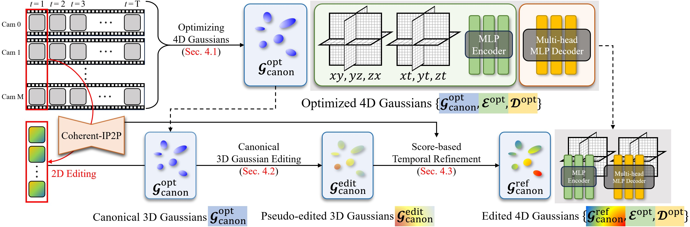

# Instruct-4DGS: Efficient Dynamic Scene Editing via 4D Gaussian-based Static-Dynamic Separation

## CVPR 2025

### [[Project Page]](https://hanbyelcho.info/instruct-4dgs/) | [[Paper]](https://openaccess.thecvf.com/content/CVPR2025/html/Kwon_Efficient_Dynamic_Scene_Editing_via_4D_Gaussian-based_Static-Dynamic_Separation_CVPR_2025_paper.html) | [[arXiv]](https://arxiv.org/abs/2502.02091) | [[Poster]](figs/Instruct-4DGS_poster.png) | [Video]

**This is the official PyTorch implementation of the approach described in the following paper:**
> [Instruct-4DGS: Efficient Dynamic Scene Editing via 4D Gaussian-based Static-Dynamic Separation](https://arxiv.org/abs/2502.02091)\
> [Joohyun Kwon*](https://scholar.google.com/citations?user=WilZkLEAAAAJ&hl=en), [Hanbyel Cho*](https://hanbyelcho.info/) and [Junmo Kim†](https://scholar.google.com/citations?hl=en&user=GdQtWNQAAAAJ) (*Equal contribution, †Corresponding author)\
> IEEE/CVF Conference on Computer Vision and Pattern Recognition ([CVPR](https://cvpr.thecvf.com/Conferences/2025)), 2025


## 🏠 Overview
Recent 4D dynamic scene editing methods require editing thousands of 2D images used for dynamic scene synthesis and updating the entire scene with additional training loops, resulting in several hours of processing to edit a single dynamic scene. Therefore, these methods are not scalable with respect to the temporal dimension of the dynamic scene (i.e., the number of timesteps). In this work, we propose Instruct-4DGS, an efficient dynamic scene editing method that is more scalable in terms of temporal dimension. To achieve computational efficiency, we leverage a 4D Gaussian representation that models a 4D dynamic scene by combining static 3D Gaussians with a Hexplane-based deformation field, which captures dynamic information. We then perform editing solely on the static 3D Gaussians, which is the minimal but sufficient component required for visual editing. To resolve the misalignment between the edited 3D Gaussians and the deformation field, which may arise from the editing process, we introduce a refinement stage using a score distillation mechanism. Extensive editing results demonstrate that Instruct-4DGS is efficient, reducing editing time by more than half compared to existing methods while achieving high-quality edits that better follow user instructions.


> Overall pipeline of our proposed dynamic scene editing method (Instruct-4DGS). To obtain the target dynamic scene for editing, we first optimize the 4D Gaussians using a multi-camera captured video dataset. We then perform 3D Gaussian editing on the static canonical 3D Gaussians by editing only the multiview images corresponding to the first timestep. We apply score-based temporal refinement to mitigate motion artifacts without additional image editing.


## 📝 TODO List
- [x] Refactor editing pipeline
- [x] Polish the codes & update the doc
- [ ] Other datasets


## Getting Started

### Installation

#### **Install Base Dependencies**

This project use [uv](https://docs.astral.sh/uv/getting-started/installation/) to manage packages. If you haven't installed uv, run `curl -LsSf https://astral.sh/uv/install.sh | sh`.

Then run the following command to install required packages. This takes a long time, so you'd better put it in the background.

```bash
uv sync
```

#### **Install Additional Packages**

There are some packages not managed by uv. We will have to build them.
First pull the source repositories as submodules.

```bash
git submodule update --init --recursive
```

Then set up some environment variables depending on your system setting before launch the building process.

```bash
export CUDA_HOME=/usr/local/cuda-12.8 # change this
export PATH=$CUDA_HOME/bin:$PATH
export LD_LIBRARY_PATH=$CUDA_HOME/lib64:$LD_LIBRARY_PATH
uv pip install ./submodules/simple-knn/ --no-build-isolation
uv pip install ./submodules/depth-diff-gaussian-rasterization/ --no-build-isolation
uv pip install -e ./submodules/mmcv -v --no-build-isolation
uv pip install -e ./submodules/sam2
```

> Building mmcv may take an hour to complete.

### Data preparation
Please follow the official 4DGS guide to process your dataset and train the model. 
For the convenience, we provide some [pre-processed files and training outputs](https://drive.google.com/drive/folders/1WIweLubEjjhDwJlRgJ8qvnAn8tZ2ogXd?usp=sharing) for the 'cook_spinach' scene from the Dynerf dataset.

1.  **Place the Initial Point Cloud**
    * **File**: `points3D_downsample2.ply`
    * **Destination**: `./data/dynerf/cook_spinach/`

2.  **Place the Trained 4DGS Output**
    * **Directory**: `point_cloud/`
    * **Destination**: `./output/dynerf/cook_spinach/`

## Editing 
You can easily run the editing pipeline using the shell script below.
```bash
# run_instruct_4dgs.sh [dataset] [scene_name] [prompt] [guidance_scale] [image_guidance_scale]
bash run_instruct_4dgs.sh dynerf cook_spinach "Make it look like a fauvism painting" 10.5 1.2
```

* Some scenes within the **Dynerf dataset** are known to have missing camera views. If you are working with one of these scenes, you will need to adapt the editing script to handle the incomplete data. To resolve this, please refer to the logic around **line 247** in the `edit_3d.py` script. 

* The pipeline provided in this repository is configured to perform a straightforward, baseline 3D editing process. For better consistency and visual quality, you can integrate other advanced 3D editing methodologies.


You can check the editing results using the script below.
```bash
python render_edited4d.py --configs ./arguments/dynerf/cook_spinach.py --ply_path "./output/dynerf/cook_spinach/point_cloud_refine/Make it look like a fauvism painting/iteration_800/point_cloud.ply" -s ./data/dynerf/cook_spinach --model_path ./output/dynerf/cook_spinach
```

##　Partial Editing

Taking cook_spinach as am example. Replace it in the path as needed.

### Mask generation

Generate a grayscale image container the ids of each label/tag for time0 images.

Before starting, you should have `sam-2` installed and run the modified `multiview_edit.py`, which will rescaled time0 images and save them at *<data dir>/time0*.

Then run:
```bash
python grounded_sam2_mask_gen.py \
    --data_dir data/dynerf/cook_spinach/time0 \
    --output_dir data/dynerf/cook_spinach/object_mask \
    --prompt "guy. bottle."
```

Outputs are *png* and their names remain the same as the original time0 images.

### time0 partial editing

The generated result will be used for partial 3D editing.

```bash
python partial_edit.py \
    --org_dir data/dynerf/cook_spinach/time0 \
    --inpaint_dir data/dynerf/cook_spinach/<inpainting_dir> \
    --mask_dir data/dynerf/cook_spinach/object_mask \
    --save_dir data/dynerf/cook_spinach/partial_edited
```

Outputs are *jpg* and their names are 0-padded indices.

## Acknowledgement
This work is built on many amazing research works and open-source projects: [4DGS](https://github.com/hustvl/4DGaussians), [Instruct-4D-to-4D](https://github.com/Friedrich-M/Instruct-4D-to-4D), etc. We are grateful for their excellent work and great contributions.

## 🔗 Citation
If you find our work helpful, please cite:
```bibtex
@InProceedings{Kwon_2025_CVPR,
    author    = {Kwon, Joohyun and Cho, Hanbyel and Kim, Junmo},
    title     = {Efficient Dynamic Scene Editing via 4D Gaussian-based Static-Dynamic Separation},
    booktitle = {Proceedings of the Computer Vision and Pattern Recognition Conference (CVPR)},
    month     = {June},
    year      = {2025},
    pages     = {26855-26865}
}
```


## :star: Star History
[](https://www.star-history.com/#juhyeon-kwon/efficient_4d_gaussian_editing&Date)
